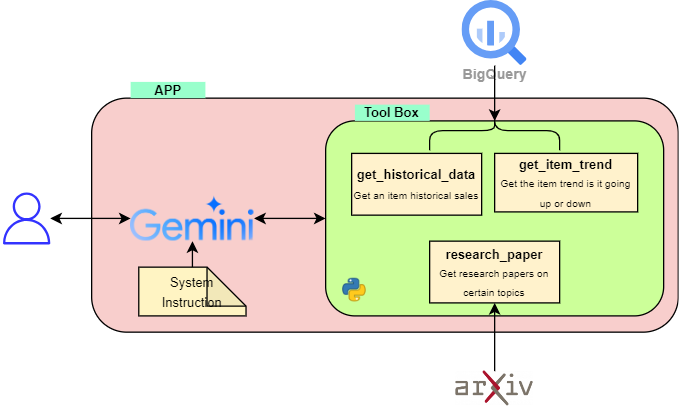

# Gemini LLM Agent
Implementation of LLM using Gemini Function Calling.

## How to Use
- Create a new environment, python=3.12
```
python -m venv myenv
```
- Create `.env` Environment Variables file
```
GOOGLE_APPLICATION_CREDENTIALS = path\to\credentials.json
PROJECT_ID = ""
LOCATION = ""
```
- Install dependencies
```
pip install -r requirements.txt
```
- Run streamlit web app
```
streamlit run app.py
```
Open `http://localhost:8501/` in your browser
